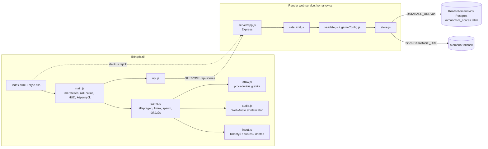
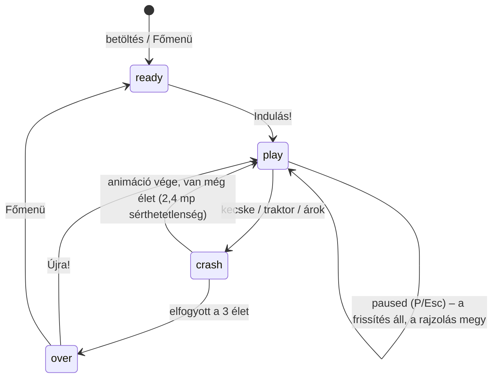

# Architektúra – KOMÁNOVICS

## 1. Áttekintés
Egyetlen Node.js (Express) folyamat szolgálja ki a build-lépés nélküli, sima HTML/Canvas/ES-modul
frontendet és a toplista REST API-t. A pontszámok PostgreSQL-ben tárolódnak (`DATABASE_URL`), ennek
hiányában memóriában (újraindításkor elvesznek).



## 2. Szerver

### Fájlok és felelősségek
- **`server/index.js`** – `createStore()` → `init()` (5 próbálkozás 3 mp-enként; ha mind elbukik → memória-fallback és hangos log), majd `createApp()` és `listen(PORT, '0.0.0.0')`. SIGTERM/SIGINT: szerver zárása + pool lezárása.
- **`server/app.js`** – `createApp({store, rateLimitPerMin})`:
  - `trust proxy = 1` (Render proxy mögött a valódi kliens-IP kell a rate limithez),
  - biztonsági fejlécek: CSP (`script-src 'self'`, inline script nincs), `X-Content-Type-Options`, `X-Frame-Options`, `Referrer-Policy`,
  - `GET /healthz` → `{ok, game, storage, table, time}`; 503 ha a DB nem válaszol,
  - `GET /api/scores` → `{storage, scores:[{name, score, level, created_at}]}` (top 10, `Cache-Control: no-store`),
  - `POST /api/scores` → rate limit → `express.json({limit:'2kb'})` → `validateScore` → `store.add` → `201 {id, rank, name, score, scores}`,
  - ismeretlen `/api/*` → 404 JSON; hibás JSON → 400; túl nagy → 413,
  - statikus fájlok `public/`-ból (`no-cache` a JS/CSS/HTML-re, 1 nap cache a képekre – nincs fájlnév-hash, ezért így marad friss a deploy után).
- **`server/gameConfig.js`** – játék-specifikus beállítások: név, alapértelmezett tábla (`komanovics_scores`), validálási határok. (A KOMÁNOVICS Darts-szal közös szerver-sablon része.)
- **`server/validate.js`** – `sanitizeName` (NFC, csak `\p{L}\p{N}` és ` ._-!?`, szóköz-összevonás, max 16), `validateScore(body, limits)` (a határok a `gameConfig.js`-ből; név kötelező, nyers hossz ≤ 64; pontszám egész 0..1 000 000; `level` 1..999; `durationSec` 0..6 óra; hihetőség: `score ≤ 300 + durationSec × 80`).
- **`server/rateLimit.js`** – IP-nkénti fix 60 mp-es ablak, alapértelmezés 5 POST/perc (`SCORE_RATE_LIMIT_PER_MIN`), 429 + `Retry-After`.
- **`server/store.js`** – két implementáció ugyanazzal az interfésszel: `kind`, `init()`, `top(limit)`, `add(row) → {id, rank}`, `health()`, `close()`.

### Adatmodell (PostgreSQL)
```sql
CREATE TABLE IF NOT EXISTS komanovics_scores (   -- tábla: SCORES_TABLE env vagy alapértelmezés
  id           SERIAL PRIMARY KEY,
  name         VARCHAR(16) NOT NULL,
  score        INTEGER NOT NULL CHECK (score >= 0 AND score <= 1000000),
  level        INTEGER NOT NULL DEFAULT 1,
  duration_sec INTEGER,
  created_at   TIMESTAMPTZ NOT NULL DEFAULT now()
);
CREATE INDEX IF NOT EXISTS komanovics_scores_score_idx ON komanovics_scores (score DESC, created_at ASC);
```
Rendezés: pontszám csökkenő, holtversenynél a korábbi beküldés nyer. A séma induláskor jön létre (nincs külön migrációs eszköz – egyetlen tábla miatt szándékosan).

**Közös adatbázis (2026-10-03 óta):** a Kománovics-játékok egy Postgres adatbázison osztoznak, **játékonként külön táblában** (KOMÁNOVICS: `komanovics_scores`, KOMÁNOVICS Darts: `darts_scores`). A tábla neve a `SCORES_TABLE` env-ből vagy a `server/gameConfig.js` alapértelmezéséből jön; mivel SQL-be interpolálódik, az `assertTableName` csak `^[a-z_][a-z0-9_]{0,62}$` nevet enged. Az index neve is táblanév-előtagos. Korábban a tábla neve `scores` volt – adatbázis sosem volt bekötve, így migráció nem kellett.

### SSL
`sslConfigFor(url, DATABASE_SSL)`: `true`/`false` felülír; különben `*.render.com` host (külső URL) → SSL `rejectUnauthorized:false`; belső Render host (`dpg-…-a`) → nincs SSL.

## 3. Kliens

### Képernyő és koordináták
- `#app` álló arányú oszlop: `width = min(100vw, 100dvh × 0.72)`; telefonon teljes képernyő.
- Logikai világ: szélesség mindig `W = 400`, magasság `H = 400 × cssH / cssW`. `main.js` a vásznat `devicePixelRatio`-val (max 2) skálázza, és `setTransform(pixelScale…)`-szal rajzol, így minden logika logikai egységekben megy.
- Út-geometria (`config.js`): mező 0–40, kerítés 40, árok 46–62 (ide borulva = ütközés), füves padka 62–90 (lassít), földút 90–310, tükrözve jobbra.

### Állapotgép (`game.js`)


### Fő ciklus
`requestAnimationFrame` → `dt = min(0.05, Δt)` → `game.update(dt)` → `game.draw(ctx)` → `updateHud()` (DOM csak változáskor íródik).

### Részeg-fizika (`Game.updatePlayer`)
1. Nyers bemenet (`input.steer()`, −1..1) idő-bélyeges pufferbe; a felhasznált érték `delay = részegség × 0,28 s` késéssel jön.
2. Elsőrendű aluláteresztő: `tau = 0,05 + részegség × 0,45 s` → „lusta” kormány.
3. Vezérelt pozíció `bx += steer × 245 × control + impulzusok`. `control` csúszáskor 0,22, ugráskor 0,35.
4. Imbolygás: `amp = 3 + drunk × 0,46` (max ~49 egység), két szinusz + `noise1` sima zaj; `x = bx + sway`.
5. Dőlés: a tényleges oldalsebességből és a kormányból, simítva; csúszáskor rezgés.
6. Csuklás 35% részegség felett véletlen időközönként: hang + oldalrántás.
7. A részegség magától csökken (1,4 / s); sör +13, kávé −45, savanyúság −18; szorzó `1 + drunk/50`.

### Spawnolás
Távolság-alapú: minden `nextGap` (alap `max(58, 165 × 0,9^(szint−1))` × 0,7–1,25) megtett egység után egy entitás, súlyozott véletlennel. Az első 4 mp csak sör; átfutó kecske 10 mp után; tyúkok 15 mp után; rohamozó kecske és traktor a 2. szinttől. Részegen (>60) a kávé/savanyúság esélye 1,8×. Traktor csak egy lehet a képernyő felső 60%-án, és a sávjából eltakarítja az új akadályokat (fair rés marad).

### Entitások
| type | viselkedés | ütközés hatása |
|---|---|---|
| `beer` | lebeg, glória | +10×szorzó pont, +13 részegség, csilingelés + csuklás |
| `coffee` / `pickle` | lebeg | −45 / −18 részegség, +5 pont |
| `goat` | áll, közeledéskor mekeg | ütközés (élet) |
| `goatRun` | a padkán vár, 330 egységen belül keresztbe fut, „!” jelzés a szélen | ütközés |
| `goatCharge` | kapál, 260 egységen belül rád ront (x-ben követ) | ütközés |
| `pothole` | – | ugrás 0,55 s (levegőben immunis a talajakadályokra), landoláskor rántás |
| `puddle` | fodrozódik | 1,3 s csúszás, kormány 22% |
| `chickens` | 5–7 tyúk; 150 egységen belül szétrebbennek | 1,6 s 50%-os lassítás, tollak |
| `tractor` | szembejön (55 + 6×szint egység/s), dudál, füstöl | ütközés |
| árok | – | ütközés („árokba borult”) |

### Ütközés-animációk (`drawCrash`, 2,2 s)
- **árok:** 1,25 fordulatos bukfenc az árokba, csobbanás, oldalt fekszik;
- **kecske:** felrepül és 1,5 fordulattal a hátára esik, a kecske odasétál és ráugrik;
- **traktor:** palacsintává lapul (keréknyommal), a végén rugózva visszaugrik.
Mindegyiknél szédült csillagok és vicces magyar szövegbuborék. Utána: −1 élet, részegség ×0,7, a közeli veszélyek törlődnek, 2,4 s villogó sérthetetlenség.

### Hang (`audio.js`)
Lánc: források → `sfx` / `music` gain → `master` (némítás) → kompresszor → kimenet. Az `AudioContext` az első gombnyomásra jön létre (`ensure()`), mert a böngészők gesztus nélkül nem engedik. Effektek oszcillátorokból és egy 1 mp-es fehérzaj-pufferből (szűrőkkel, burkológörbékkel). Zene: 16 ütemes C-dúr polka 132 BPM-en; harmonika-hangszín 3 elhangolt oszcillátorral (−9/0/+9 cent, „musette”) + aluláteresztő; oom-pah basszus és akkordok; 50 ms-os `setInterval` lookahead ütemező 0,25 s előretekintéssel.

### Grafika (`draw.js`)
Minden procedurális canvas-rajz, kivéve Eduárd fejét (`assets/eduard-head.png`, a felhasználó saját képéből kivágva). A háttér egy 400×512-es, függőlegesen varratmentes csempe, amely a pixelsűrűséghez igazítva egyszer renderelődik (`buildBackgroundTile`), görgetéskor csak `drawImage`. Rajzolási sorrend: csempe → díszletek (fák kivételével) → kátyú/pocsolya → por → tárgyak és állatok y szerint → játékos / ütközés-animáció → traktorok → fák lombja → részecskék → figyelmeztetések → lebegő szövegek → részeg vignetta.

## 4. Fontos implementációs döntések
| Probléma | Lehetőségek | Választás és miért | Kompromisszum |
|---|---|---|---|
| Frontend technológia | React/Vite, Phaser, sima Canvas | **Sima Canvas + ES modulok, build nélkül** – a felhasználó kérte, nincs build-lépés, kis méret | Nincs fájlnév-hash → `Cache-Control: no-cache` a JS/CSS-re |
| A karakter megjelenítése | teljesen canvas-rajz, sprite sheet, kivágott fej | **Kivágott fej a saját képből + canvas test** – így tényleg „Eduárd” | A fej szemből néz, a test hátulnézet (rajzfilmes „visszanéz” hatás) |
| Fej-kivágás | kézi ovális maszk, rembg/ML | **HSV színszegmentálás + ovális maszk + lyukkitöltés** (`tools/crop_head.py`) – nincs nehéz függőség, jó eredmény | Új forrásképnél újra kell hangolni |
| HUD | canvasra rajzolva, DOM | **DOM** – éles szöveg, egyszerű gombok, akadálymentesebb | DOM-írást minimalizálni kell (csak változáskor) |
| Hangok | hangfájlok, Web Audio szintézis | **Web Audio szintézis** – követelmény volt, 0 letöltés | Hangszín egyszerűbb, mint felvett hang |
| Tárolás | csak Postgres, SQLite, Postgres + memória | **Postgres, memória-fallback** – helyben DB nélkül is fut | Memóriában újraindításkor elveszik |
| Rate limit | express-rate-limit csomag, saját | **Saját ~30 soros** – függőség-takarékosság | Csak egy példányon belül érvényes |
| Anti-cheat | aláírt munkamenet, szerveroldali szimuláció, hihetőségi korlát | **Hihetőségi korlát (pont/idő)** – egyszerű | Kliens-oldali pontszám hamisítható a korláton belül |
| Deploy | Blueprint, MCP direkt létrehozás | **MCP direkt** (a feladat ezt kérte) + `render.yaml` dokumentációként/újrahúzáshoz | A Blueprint nincs szinkronizálva a futó szolgáltatással |

## 5. Külső függőségek
| Csomag | Verzió | Miért |
|---|---|---|
| Node.js | ≥ 20 (helyben 20.19.2, Renderen `NODE_VERSION=20`) | futtatókörnyezet, beépített `fetch`, `node:test` |
| express | ^4.21 (telepítve 4.22.3) | HTTP + statikus fájlok |
| pg | ^8.13 (telepítve 8.23.1) | PostgreSQL kliens |
| puppeteer-core (dev) | ^25.12 | smoke teszt helyi Chrome-mal (nem tölt le böngészőt) |
| Python 3 + Pillow, numpy, scipy | csak eszköz | `tools/crop_head.py` (nem kell futtatáshoz) |
